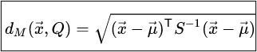
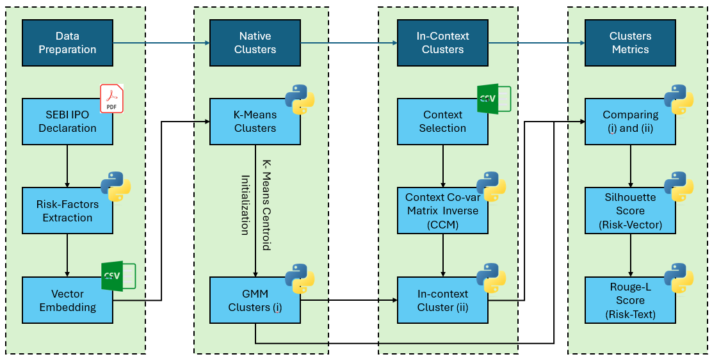
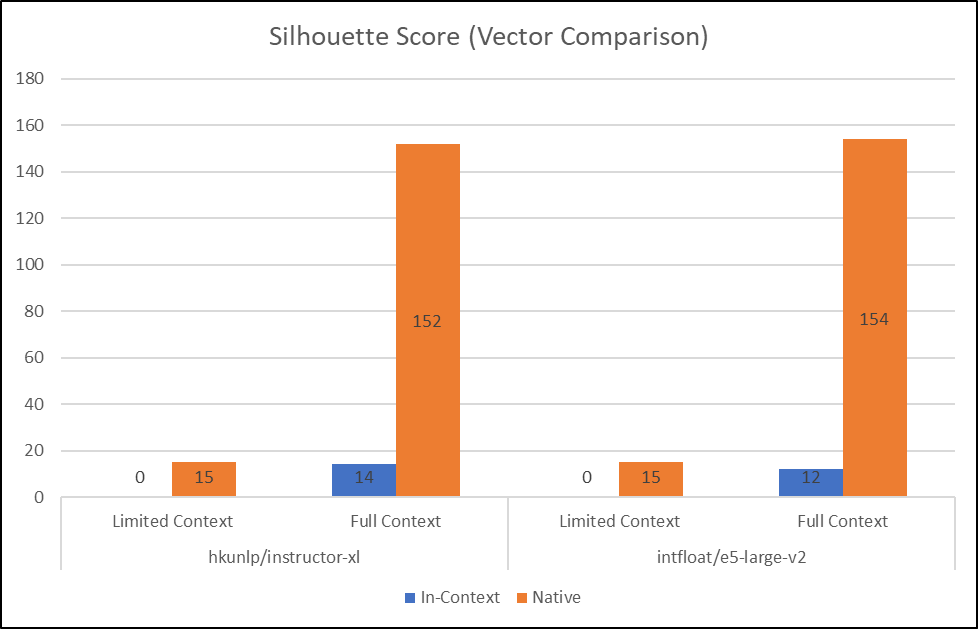
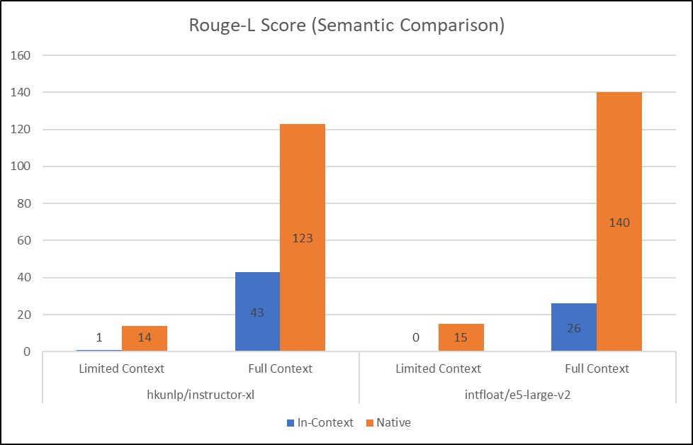

# LLM_InContext_Clustering
Defining and assessing the performance of the In-Context distance metric for clustering statements vectorized using LLMs

## Project Goal

LLMs represent a potent black-box tool in natural language processing (NLP), yet their utility hinges on reliability. The aim of this project is to enhance the reliability of employing LLMs in NLP by establishing appropriate contextual frameworks. Specifically, this project seeks to refine conventional Machine Learning tasks(specifically clustering).
*Project Jupyter Notebooks available on request*

## Project Summary

I've generated vector embeddings for risk factors extracted from over 150 SEBI IPO Red Herring Prospectuses, leveraging two different LLM Libraries. The objective is to cluster the risk factors mentioned within each individual IPO Prospectus. The context is established by grouping together similar IPOs.

For each company within the specified context, I've clustered the vectorized risk factors using two methods:

1) Native Clustering Algorithm: This involves applying K-Means followed by Gaussian Mixture Model Clustering.
2) In-Context Clustering Algorithm: Here, the Native Cluster method is modified by incorporating the **in-context distance** from each cluster centroid.

**Study is repeated for two different context lengths (15 IPOs and 166 IPOs) across two different LLM Libaries (hkunlp/instructor-xl and intfloat/e5-large-v2)**

The two clustering algorithms are compared on the quality of their clustering performance:

1) Silhouette scores (Risk Factor Vectors)
2) Rouge-L scores (Risk Factor Statements) 

## In-Context Distance

**$S^-1$: Inverse covariance matrix of all the vectors in the selected context**

## Project Process Flowchart (For a given context length)

## Project Phases

### Data Pre-Processing

1) Downloaded IPO Red Herring Prospectuses from SEBI's website

2) Extracted the Risk Factors mentioned in each prospectus using Python

3) Setup the Risk Factors and generate vector embeddings (**hkunlp/instructor-xl** and **intfloat/e5-large-v2**)

4) Contain the vector embeddings and risk factors in a single csv file in lieu of a vector database

### Native Clustering (Repeat for each LLM Library)

1) For each company, determine the required number of clusters (n) based on the number of risk factors

2) Cluster the risk factor vector embeddings into n clusters using **k-means clustering**

3) Cluster the risk factor vector embeddings into n clusters using **Gaussian Mixture Model clustering** with the **k-means cluster centers as initialization**

### In-Context Clustering (Repeat for each LLM Library and each Context Length)

1) List out all the relevant risk factors to build the context

2) Calculate the **covariance matrix inverse** for all the **context risk factors vector embeddings**

3) For each risk factor identify the closest cluster (from the native clusters) using the **Mahalanobis Distance (context covariance)**

## Clustering Outcomes Analysis

### Silhouette Scores Study (Multiple Context Lengths, LLM Libraries)

### Rouge-L Scores Study (Multiple Context Lengths, LLM Libraries)

## Project Conclusion

The In-Context Clustering Algorithm performs better than the Native Clustering Algorithm in a minority of the instances.
However, the in-context clustering algorithm improves with increasing context.

**With the suitable context length, in-context distance could be a reliable metric for NLP and machine learning with text data**